# OSFormatCurrency — Architecture

Structural reference for the solution, the runtime component, and the test
projects. Keep this file in sync with the code — the `documentation-updater`
agent updates it as part of the change cycle whenever the solution layout,
Server Action surface, dependency set, or project structure changes.

> **Runtime behaviour**, **Server Action signatures**, and **supported locales**
> live in [README.md](./README.md) and the [docs/platform/](./docs/platform)
> Forge copies. This document describes **structure only** — how the code is
> organised, why it is split the way it is, and where each concern lives.

---

## 1. Solution layout

```
OSFormatCurrency/                                ← repo root
├── FormatCurrency.sln                           ← solution (loads all four .csproj files)
├── FormatCurrency/                              ← ODC External Library (net10.0)
├── FormatCurrency.Tests/                        ← ODC xUnit suite (net10.0)
├── FormatCurrency.O11/                          ← O11 Integration Studio extension (net48)
├── FormatCurrency.O11.Tests/                    ← O11 xUnit suite (net48)
├── xif/                                         ← Integration Studio source tree
├── docs/                                        ← README/Forge copies, versioned changelogs
└── tools/                                       ← sample generators
```

---

## 2. ODC External Library — `FormatCurrency/`

Target framework: **`net10.0`**. Namespace: `FormatCurrency`.
Primary class: `FormatCurrency`, implementing `IFormatCurrency`.

### Public surface

| File | Type | Purpose |
|------|------|---------|
| [IFormatCurrency.cs](FormatCurrency/IFormatCurrency.cs) | `[OSInterface]` | Declares `GetCurrencyFormattedByLocale`, `GetLocales`, `GetDecimalFromLocaleDecimalString` |
| [FormatCurrencyStructures.cs](FormatCurrency/FormatCurrencyStructures.cs) | `[OSStructure]` | `LocaleInfo` (11 fields), `ParseDecimalResult` (4 fields) |

### Implementation file

| File | Responsibility |
|------|---------------|
| [FormatCurrency.cs](FormatCurrency/FormatCurrency.cs) | All 3 action implementations, Chinese numeral conversion tables and algorithm (`ChineseNumberConvert`, `ChineseSmallNumberConvert`), currency pattern tables (`NegativePatterns`, `PositivePatterns`) |

### Runtime dependencies

Declared in [FormatCurrency.csproj](FormatCurrency/FormatCurrency.csproj).

| Package | License | Purpose |
|---------|---------|---------|
| `OutSystems.ExternalLibraries.SDK` | OutSystems proprietary | `[OSInterface]`, `[OSAction]`, `[OSStructure]` attributes |

No third-party dependencies — runs entirely on the .NET Base Class Library (`System.Globalization`).

### ODC processing flow

```mermaid
flowchart LR
    In[inputs] --> Action{Which action?}
    Action -->|GetCurrencyFormattedByLocale| Format[CultureInfo.GetCultureInfo<br/>→ NumberFormatInfo clone<br/>→ decimal.ToString&#40;C, nfi&#41;]
    Action -->|GetLocales| Enum[CultureInfo.GetCultures<br/>→ map to LocaleInfo list]
    Action -->|GetDecimalFromLocaleDecimalString| Parse[Replace native digits<br/>→ decimal.Parse&#40;NumberStyles.Currency&#41;]
    Format -->|Chinese numeral mode| Chinese[ChineseNumberConvert<br/>→ positional numeral system]
    Format -->|Native digits mode| NativeDigits[Replace 0-9 with<br/>NativeDigits array]
    Format & Chinese & NativeDigits --> Out[string output]
    Enum --> Out2[List&lt;LocaleInfo&gt; output]
    Parse --> Out3[ParseDecimalResult output]
```



### Build & package

`FormatCurrency/generate_upload_package.ps1` runs
`dotnet publish -c Release -r linux-x64 --self-contained false` and zips the
publish folder into `ExternalLibrary.zip`. The 90 MB ODC upload ceiling is
enforced by the script.

---

## 3. O11 Integration Studio Extension — `FormatCurrency.O11/`

Target framework: **`net48`**, `LangVersion=10`. Namespace: `OutSystems.NssFormatCurrency`.

### Public surface (Integration Studio–generated names)

| File | Type | Purpose |
|------|------|---------|
| [IssFormatCurrency.cs](FormatCurrency.O11/IssFormatCurrency.cs) | Interface | Declares `MssGetCurrencyFormattedByLocale`, `MssGetLocales`, `MssGetDecimalFromLocaleDecimalString` |
| [RecLocale.cs](FormatCurrency.O11/RecLocale.cs) | Struct | `ss`-prefixed counterpart of `LocaleInfo` (11 fields) |

`ParseDecimalResult` is not a separate struct in O11 — its fields are exposed as individual `out` parameters on the action.

### Implementation

| File | Responsibility |
|------|---------------|
| [Actions/FormatCurrencyActions.cs](FormatCurrency.O11/Actions/FormatCurrencyActions.cs) | `CssFormatCurrency : IssFormatCurrency` — all 3 actions, Chinese numeral tables and conversion, pattern tables |

Logic is functionally identical to the ODC implementation. The only differences are the O11 naming conventions and the `ParseDecimalResult` fields being flat `out` parameters.

### Runtime dependencies

No NuGet packages — runs entirely on the .NET Framework 4.8 BCL (`System.Globalization`).

---

## 4. Test projects

### `FormatCurrency.Tests/` (ODC, net10.0)

| File | Responsibility |
|------|---------------|
| TestHelpers.cs | Partial-class shell |
| GetCurrencyFormattedByLocaleTests.cs | Formatting tests: locales, custom currency, native digits, Chinese standard + financial, negative values |
| GetDecimalFromLocaleDecimalStringTests.cs | Parsing tests: valid, empty, invalid locale, format errors, native digit replacement |
| GetLocalesTests.cs | Enumeration tests: non-empty, contains expected locales, field population |

### `FormatCurrency.O11.Tests/` (O11, net48)

| File | Responsibility |
|------|---------------|
| TestHelpers.cs | O11 adapter types: `LocaleInfo` struct, `ParseDecimalResult` struct, `IFormatCurrency` interface, `FormatCurrency` wrapper class |
| GetCurrencyFormattedByLocaleTests.cs | Byte-for-byte identical to ODC |
| GetDecimalFromLocaleDecimalStringTests.cs | Byte-for-byte identical to ODC |
| GetLocalesTests.cs | Byte-for-byte identical to ODC |

The adapter pattern maps `CssFormatCurrency.MssGet*` methods and `RecLocale` `ss`-prefixed fields back to ODC property names so all test files compile unchanged.

---

## 5. Naming conventions

| Concern | ODC (`net10.0`) | O11 (`net48`) |
|---------|----------------|---------------|
| Interface | `IFormatCurrency` | `IssFormatCurrency` |
| Implementation | `FormatCurrency` | `CssFormatCurrency` |
| Structures | `LocaleInfo`, `ParseDecimalResult` | `RecLocale` (flat out params for parse result) |
| Namespace | `FormatCurrency` | `OutSystems.NssFormatCurrency` |
| Method prefix | *(none)* | `Mss` |
| Parameter/field prefix | *(none)* | `ss` |

---

## 6. Public surface summary

| Server Action | ODC return type | O11 signature style |
|---------------|----------------|---------------------|
| `GetCurrencyFormattedByLocale` | `string` | `void Mss…(…, out string)` |
| `GetLocales` | `List<LocaleInfo>` | `void Mss…(out List<RecLocale>)` |
| `GetDecimalFromLocaleDecimalString` | `ParseDecimalResult` | `void Mss…(…, out bool, out int, out string, out decimal)` |
